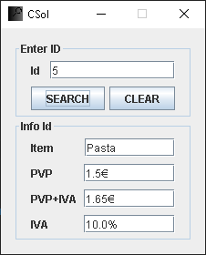

<h1>Catalog Searcher for Items in Java [MVC] </h1>

This project aims to have an application that dumps a database (MySQL workbench) and, through a window, the different items can be searched and their characteristics displayed.

<h2>Visual of Catalog Searcher </h2>

    
    

